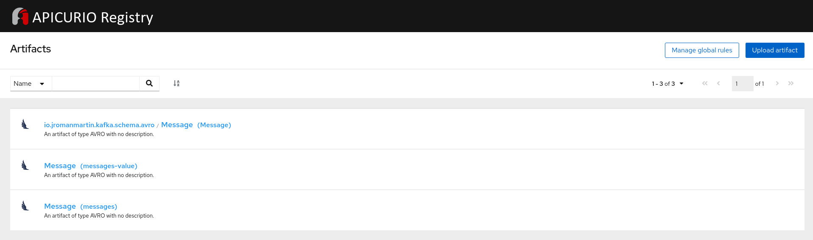

# Kafka Clients Quarkus Edition

## :rocket: :sparkles: :rotating_light: QUARKUS EDITION :rotating_light: :sparkles: :rocket:

This repo is a fork of the original one based in [Spring Boot](https://github.com/rmarting/kafka-clients-sb-sample)
but refactored to be a full-compliant [Quarkus](https://quarkus.io/) application. This repo is described in
[Integrating Quarkus and Apicurio Service Registry](https://blog.jromanmartin.io/2020/12/18/integrating-quarkus-and-apicurio-service-registry.html)
blog post.

The following components were refactored from Spring Boot to Quarkus Extensions:

| Spring Boot Dependency | Quarkus Extension |
|------------------------|--------------------|
| spring-boot-starter-web | [REST Services](https://quarkus.io/guides/rest-json) |
| spring-boot-starter-actuator | [Microprofile Health](https://quarkus.io/guides/microprofile-health) |
| springdoc-openapi-ui | [OpenAPI and Swagger UI](https://quarkus.io/guides/openapi-swaggerui) |
| spring-kafka | [Kafka with Reactive Messaging](https://quarkus.io/guides/kafka) |
| avro | [Kafka, Schema Registry and Avro](https://quarkus.io/blog/kafka-avro/) |
| apicurio-registry-utils-serde | [Apicurio Registry](https://github.com/Apicurio/apicurio-registry) |

This new version is really fast (less than 2 seconds) ... like a :rocket: 

```text
Jun 30, 2021 9:57:02 PM io.quarkus.bootstrap.runner.Timing printStartupTime
INFO: kafka-clients-quarkus-sample 2.0.0-SNAPSHOT on JVM (powered by Quarkus 2.0.0.Final) started in 1.755s. Listening on: http://0.0.0.0:8181
```

## :rocket: :sparkles: :rotating_light: QUARKUS EDITION :rotating_light: :sparkles: :rocket: 

This sample project demonstrates how to use [Kafka Clients](https://mvnrepository.com/artifact/org.apache.kafka/kafka-clients)
and [SmallRye Reactive Messaging](https://smallrye.io/smallrye-reactive-messaging) on Quarkus to send and consume messages from an
[Apache Kafka](https://kafka.apache.org/) cluster. The Apache Kafka cluster is operated by [Strimzi](https://strimzi.io/)
operator deployed on a Kubernetes or OpenShift Platform. These messages will be validated by a Schema Registry or Service Registry
operated by [Apicurio](https://www.apicur.io/registry/docs/apicurio-registry/index.html#intro-to-the-registry) operator.

Apache Kafka is an open-sourced distributed event streaming platform for high-performance data pipelines,
streaming analytics, data integration, and mission-critical applications.

Service Registry is a datastore for sharing standard event schemas and API designs across API and event-driven architectures.
You can use Service Registry to decouple the structure of your data from your client applications, and to share and
manage your data types and API descriptions at runtime using a REST interface.

The example includes a simple REST API with the following operations:

* Send messages to a Topic
* Consume messages from a Topic

To deploy this application into a Kubernetes/OpenShift environment, we use the amazing [JKube](https://www.eclipse.org/jkube/).

## Environment

This project requires a Kubernetes or OpenShift platform available. If you do not have one, you could use
one of the following resources to deploy locally a Kubernetes or OpenShift Cluster:

* [Red Hat CodeReady Containers - OpenShift 4 on your Laptop](https://github.com/code-ready/crc)
* [Minikube - Running Kubernetes Locally](https://kubernetes.io/docs/setup/minikube/)

This repo was tested with the following latest versions of Red Hat CodeReady Containers and Minikube:

```shell
❯ crc version
CodeReady Containers version: 1.35.0+751824a9
OpenShift version: 4.9.5 (embedded in executable)
❯ minikube version
minikube version: v1.24.0
commit: 76b94fb3c4e8ac5062daf70d60cf03ddcc0a741b
```

> Note: Whatever the platform you are using (Kubernetes or OpenShift), you could use the
> Kubernetes CLI (```kubectl```) or OpenShift CLI (```oc```) to execute the commands described in this repo.
> To reduce the length of this document, the commands displayed will use the Kubernetes CLI. When a specific
> command is only valid for Kubernetes or OpenShift it will be identified.

To deploy the resources, we will create a new ```amq-streams-demo``` namespace in the cluster in the case of Kubernetes:

```shell
❯ kubectl create namespace amq-streams-demo
```

If you are using OpenShift, then we will create a project:

```shell
❯ oc new-project amq-streams-demo
```

> Note: All the commands should be executed in this namespace. You could permanently save the namespace for
> all subsequent ```kubectl``` commands in that context.
>
> In Kubernetes:
>
> ```shell
> ❯ kubectl config set-context --current --namespace=amq-streams-demo
> ```
>
> In OpenShift:
>
> ```shell
> ❯ oc project amq-streams-demo
> ```

### Start Red Hat CodeReady Containers

To start up your local OpenShift 4 cluster:

```shell
❯ crc setup
❯ crc start -p /PATH/TO/your-pull-secret-file.json
```

You could promote `developer` user as `cluster-admin` with the following command:

```shell
❯ oc adm policy add-cluster-role-to-user cluster-admin developer
clusterrole.rbac.authorization.k8s.io/cluster-admin added: "developer"
```

### Start Minikube

To start up your local Kubernetes cluster:

```shell
❯ minikube start
❯ minikube addons enable ingress
❯ minikube addons enable registry
❯ minikube addons enable olm
```

### Deploying Strimzi and Apicurio Operators

> **NOTE**: Only *cluster-admin* users could deploy Kubernetes Operators. This section must
> be executed with one of them.

To deploy the Strimzi and Apicurio Operators only to inspect our namespace, we need to use
an ```OperatorGroup```. An OperatorGroup is an OLM resource that provides multitenant configuration to
OLM-installed Operators. For more information about this object, please review the
official documentation [here](https://docs.openshift.com/container-platform/4.7/operators/understanding/olm/olm-understanding-operatorgroups.html).

```shell
❯ kubectl apply -f src/main/olm/operator-group.yml
operatorgroup.operators.coreos.com/amq-streams-demo-og created
```

Now we are ready to deploy the Strimzi and Apicurio Operators:

For Kubernetes use the following subscriptions:

```shell
❯ kubectl apply -f src/main/strimzi/operator/subscription-k8s.yml
subscription.operators.coreos.com/strimzi-kafka-operator created
❯ kubectl apply -f src/main/apicurio/operator/subscription-k8s.yml
subscription.operators.coreos.com/apicurio-registry created
```

For OpenShift use the following subscriptions:

```shell
❯ oc apply -f src/main/strimzi/operator/subscription.yml
subscription.operators.coreos.com/strimzi-kafka-operator created
❯ oc apply -f src/main/apicurio/operator/subscription.yml 
subscription.operators.coreos.com/apicurio-registry created
```

You could check that operators are successfully registered with the following command:

```shell
❯ kubectl get csv
NAME                                             DISPLAY                      VERSION              REPLACES                           PHASE
apicurio-registry-operator.v1.0.0-v2.0.0.final   Apicurio Registry Operator   1.0.0-v2.0.0.final                                      Succeeded
strimzi-cluster-operator.v0.24.0                 Strimzi                      0.23.0               strimzi-cluster-operator.v0.23.0   Succeeded
```

or verify the pods are running:

```shell
❯ kubectl get pod
NAME                                               READY   STATUS    RESTARTS   AGE
apicurio-registry-operator-5b885fb47c-5dgw5        1/1     Running   0          2m36s
strimzi-cluster-operator-v0.24.0-888d55ccb-q8cgl   1/1     Running   0          2m43s
```

For more information about how to install Operators using the CLI command, please review this [article](
https://docs.openshift.com/container-platform/4.7/operators/admin/olm-adding-operators-to-cluster.html#olm-installing-operator-from-operatorhub-using-cli_olm-adding-operators-to-a-cluster)

### Deploying Kafka

```src/main/strimzi``` folder includes a set of custom resource definitions to deploy a Kafka Cluster
and some Kafka Topics using the Strimzi Operators.

To deploy the Kafka Cluster:

```shell
❯ kubectl apply -f src/main/strimzi/kafka/kafka.yml
kafka.kafka.strimzi.io/my-kafka created
```

> If you want to deploy a Kafka Cluster with HA capabilities, there is a definition
> in [kafka-ha.yml](./src/main/strimzi/kafka/kafka-ha.yml) file.

To deploy the Kafka Topics:

```shell
❯ kubectl apply -f src/main/strimzi/topics/kafkatopic-messages.yml
kafkatopic.kafka.strimzi.io/messages created
```

> If you want to use a Kafka Topic with HA capabilities, there is a definition
> in [kafkatopic-messages-ha.yml](./src/main/strimzi/topics/kafkatopic-messages-ha.yml) file.

There is a set of different users to connect to Kafka Cluster. We will deploy here to be used later.

```shell
❯ kubectl apply -f src/main/strimzi/users/
kafkauser.kafka.strimzi.io/application created
kafkauser.kafka.strimzi.io/service-registry-scram created
kafkauser.kafka.strimzi.io/service-registry-tls created
```

After some minutes Kafka Cluster will be deployed:

```shell
❯ kubectl get pod
NAME                                                READY   STATUS    RESTARTS   AGE
apicurio-registry-operator-cbf6fcf57-d6shn          1/1     Running   0          4m32s
my-kafka-entity-operator-6d9596458b-rl5w9           3/3     Running   0          59s
my-kafka-kafka-0                                    2/2     Running   0          2m6s
my-kafka-zookeeper-0                                1/1     Running   0          3m20s
strimzi-cluster-operator-v0.19.0-7555cff6d9-vlgwp   1/1     Running   0          4m37s
```

### Service Registry

Service Registry needs a set of Kafka Topics to store schemas and metadata of them. We need to execute the following
commands to create the KafkaTopics and to deploy an instance of Service Registry:

```shell
❯ kubectl apply -f src/main/apicurio/topics/
kafkatopic.kafka.strimzi.io/kafkasql-journal created
❯ kubectl apply -f src/main/apicurio/service-registry.yml
apicurioregistry.apicur.io/service-registry created
```

A new Deployment/DeploymentConfig is created with the prefix ```service-registry-deployment-``` and a new route with
the prefix ```service-registry-ingress-```. We must inspect it to get the route created to expose the Service Registry API.

In Kubernetes, we will use an ingress entry based with ```NodePort```. To get the ingress entry:

```shell
❯ kubectl get deployment | grep service-registry-deployment
service-registry-deployment
❯ kubectl expose deployment service-registry-deployment --type=NodePort --port=8080
service/service-registry-deployment exposed
❯ kubectl get service/service-registry-deployment
NAME                          TYPE       CLUSTER-IP       EXTERNAL-IP   PORT(S)          AGE
service-registry-deployment   NodePort   10.110.228.232   <none>        8080:30957/TCP   12s 
❯ minikube service service-registry-deployment --url -n amq-streams-demo
http://192.168.50.174:30957
```

In OpenShift, we only need to check the ```host``` attribute from the OpenShift Route:

```shell
❯ oc get route
NAME                             HOST/PORT                                            PATH   SERVICES                   PORT    TERMINATION   WILDCARD
service-registry-ingress-48txm   service-registry.amq-streams-demo.apps-crc.testing   /      service-registry-service   <all>                 None
```

While few minutes until your Service Registry has deployed.

The Service Registry Web Console and API endpoints will be available from: 

* **Web Console**: http://<KUBERNETES_OPENSHIFT_SR_ROUTE_SERVICE_HOST>/ui/
* **API REST**: http://KUBERNETES_OPENSHIFT_SR_ROUTE_SERVICE_HOST/apis/registry/v2

Set up the ```apicurio.registry.url``` property in the ```pom.xml``` file the Service Registry url before to publish the
schemas used by this application:

```shell
❯ oc get route -l app=service-registry -o jsonpath='{.items[0].spec.host}'
```

To register the schemas in Service Registry running in Kubernetes:

```shell script
❯ ./mvnw clean generate-sources -Papicurio \
  -Dapicurio.registry.url=$(minikube service service-registry-deployment --url -n amq-streams-demo)/apis/registry/v2
```

To register the schemas in Service Registry running in OpenShift:

```shell
❯ ./mvnw clean generate-sources -Papicurio
```

The next screenshot shows the schemas registered in the Web Console:

 

# Build and Deploy

Before we build the application we need to set up some values in ```src/main/resources/application.properties``` file.

Review and set up the right values from your Kafka Cluster 

* **Kafka Bootstrap Servers**: Kafka brokers are defined by a Kubernetes or OpenShift service created by Strimzi when
the Kafka cluster is deployed. This service, called *cluster-name*-kafka-bootstrap exposes 9092 port for plain
traffic and 9093 for encrypted traffic. 

```text
app.kafka.bootstrap-servers = my-kafka-kafka-bootstrap:9092
```

* **Kafka User Credentials**: Kafka Cluster requires authentication, we need to set up the Kafka User credentials
in our application (```app.kafka.user.*``` properties in ```application.properties``` file). Each KafkaUser has its own
secret to store the password. This secret must be checked to extract the password for our user.

To extract the password of the KafkaUser and declare as Environment Variable:

```shell
❯ export KAFKA_USER_PASSWORD=$(kubectl get secret application -o jsonpath='{.data.password}' | base64 -d)
```

It is a best practice use directly the secret as variable in our deployment in Kubernetes or OpenShift. We could do
it declaring the variable in the container spec as:

```yaml
spec:
  template:
    spec:
      containers:
        - env:
          - name: KAFKA_USER_PASSWORD
            valueFrom:
              secretKeyRef:
                key: password
                name: application
```

There is a deployment definition in [deployment.yml](./src/main/jkube/deployment.yml) file. This file will be used
by JKube to deploy our application in Kubernetes or OpenShift.

* **Service Registry API Endpoint**: Avro SerDe classes need to communicate with the Service Registry API to check and
validate the schemas. 

```text
apicurio.registry.url = http://service-registry.amq-streams-demo.apps-crc.testing/apis/registry/v2
```

To build the application:

```shell
❯ ./mvnw clean package
```

To run locally:

```shell
❯ export KAFKA_USER_PASSWORD=$(kubectl get secret application -o jsonpath='{.data.password}' | base64 -d)
❯ ./mvnw compile quarkus:dev
```

Or you can deploy into Kubernetes or OpenShift platform using [Eclipse JKube](https://github.com/eclipse/jkube) Maven Plug-ins:

To deploy the application using the Kubernetes Maven Plug-In:

```shell
❯ eval $(minikube docker-env)
❯ kubectl create -f src/main/k8s/role.yml
❯ ./mvnw package k8s:resource k8s:build k8s:apply -Pkubernetes
```

If you want to deploy the native version of this project:

```shell
❯ eval $(minikube docker-env)
❯ kubectl create -f src/main/k8s/role.yml
❯ ./mvnw package k8s:resource k8s:build k8s:apply -Pnative,kubernetes
```

To deploy the application using the OpenShift Maven Plug-In (only valid for OpenShift Platform):

```shell script
❯ ./mvnw package oc:resource oc:build oc:apply -Popenshift
```

If you want to deploy the native version of this project:

```shell script
❯ ./mvnw package oc:resource oc:build oc:apply -Pnative,openshift -Dquarkus.native.container-build=true
```

# REST API

REST API is available from a Swagger UI at:

```text
http://<KUBERNETES_OPENSHIFT_ROUTE_SERVICE_HOST>/swagger-ui
```

**KUBERNETES_OPENSHIFT_ROUTE_SERVICE_HOST** will be the route create on Kubernetes or OpenShift to expose outside the
service. 

To get the route the following command in OpenShift give you the host:

```shell script
❯ oc get route kafka-clients-quarkus-sample -o jsonpath='{.spec.host}'
```

There are two groups to manage a topic from a Kafka Cluster.

* **Producer**: Send messageDTOS to a topic 
* **Consumer**: Consume messageDTOS from a topic

## Producer REST API

Sample REST API to send messages to a Kafka Topic.
Parameters:

* **topicName**: Topic Name
* **messageDTO**: Message content based in a custom messageDTO:

Model:

```text
MessageDTO {
  key (integer, optional): Key to identify this message,
  timestamp (string, optional, read only): Timestamp,
  content (string): Content,
  partition (integer, optional, read only): Partition number,
  offset (integer, optional, read only): Offset in the partition
}
```

Simple Sample:

```shell script
❯ curl -X POST http://$(oc get route kafka-clients-quarkus-sample -o jsonpath='{.spec.host}')/producer/kafka/messages \
-H "Content-Type:application/json" -d '{"content": "Simple message"}' | jq
{
  "content": "Simple message",
  "offset": 3,
  "partition": 0,
  "timestamp": 1581087543362
}
```

With minikube:

```shell script
❯ curl $(minikube ip):$(kubectl get svc kafka-clients-quarkus-sample -o jsonpath='{.spec.ports[].nodePort}')/producer/kafka/messages \
-H "Content-Type:application/json" -d '{"content": "Simple message from Minikube"}' | jq
{
  "content": "Simple message from Minikube",
  "offset": 4,
  "partition": 0,
  "timestamp": 1596203271368
}
```

## Consumer REST API

Sample REST API to consume messages from a Kafka Topic.
Parameters:

* **topicName**: Topic Name (Required)
* **partition**: Number of the partition to consume (Optional)
* **commit**: Commit messaged consumed. Values: true|false

Simple Sample:

```shell script
❯ curl -v "http://$(oc get route kafka-clients-quarkus-sample -o jsonpath='{.spec.host}')/consumer/kafka/messages?commit=true&partition=0" | jq
{
  "messages": [
    {
      "content": "Simple message",
      "offset": 0,
      "partition": 0,
      "timestamp": 1581087539350
    },
    ...
    {
      "content": "Simple message",
      "offset": 3,
      "partition": 0,
      "timestamp": 1581087584266
    }
  ]
}
```

With minikube:

```shell script
❯ curl $(minikube ip):$(kubectl get svc kafka-clients-quarkus-sample -o jsonpath='{.spec.ports[].nodePort}')"/consumer/kafka/messages?commit=true&partition=0" | jq
{
  "messages":[
    {
      "content": "Simple message from Minikube",
      "offset": 4,
      "partition": 0,
      "timestamp": 1596203271368
    }
  ]
}
```

That's all folks! You have been deployed a full stack of components to produce and consume checked and
valid messages using a schema declared. Congratulations!.

## Main References

* [Strimzi](https://strimzi.io/)
* [Apicurio](https://www.apicur.io/)
* [OperatorHub - Strimzi](https://operatorhub.io/operator/strimzi-kafka-operator)
* [OperatorHub - Apicurio Registry](https://operatorhub.io/operator/apicurio-registry)
* [Quarkus - Building applications with Maven](https://quarkus.io/guides/maven-tooling)
* [Quarkus - Writing JSON REST Services](https://quarkus.io/guides/rest-json)
* [Quarkus - Using OpenAPI and Swagger UI](https://quarkus.io/guides/openapi-swaggerui)
* [Quarkus - Contexts and Dependency Injection](https://quarkus.io/guides/cdi-reference)
* [Quarkus - Using Apache Kafka with Reactive Messaging](https://quarkus.io/guides/kafka)
* [Quarkus - How to Use Kafka, Schema Registry and Avro with Quarkus](https://quarkus.io/blog/kafka-avro/)
* [Quarkus - Configuring your application](https://quarkus.io/guides/config)
